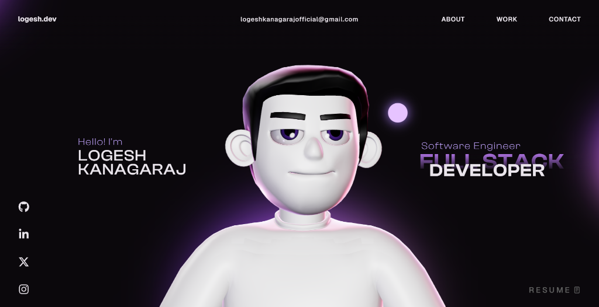

# 🚀 Logesh Kanagaraj - Personal Portfolio (LokiCodeVerse)

Welcome to the source code for my interactive 3D personal portfolio! 

This project showcases my skills as a Software Engineer & Full Stack Developer using modern web technologies to create a premium, immersive digital experience.

## 🛠️ Tech Stack
- **Frontend:** React, TypeScript, HTML5, CSS3, JavaScript
- **3D & Animation:** Three.js, React Three Fiber, WebGL, GSAP (ScrollTrigger & ScrollSmoother)
- **Tooling:** Vite, ESLint

## 🌟 Key Features
- **Interactive 3D Avatar:** Custom 3D character with procedural generation, mouse tracking, and smooth idle animations.
- **Dynamic Scroll Effects:** Immersive scrolling experience powered by GSAP.
- **Projects Showcase:** Highlights of my latest full-stack, AI, and frontend development projects.

## 👨‍💻 About Me

I am a Full Stack Developer passionate about Artificial Intelligence, LLMs, and building scalable web applications. Explore my work at my [live site](https://logesh-kanagaraj.netlify.app/) (update with your actual URL) or connect with me on [GitHub](https://github.com/Logesh-Kanagaraj-official) and [Instagram](https://www.instagram.com/logesh__kanagaraj/).

## 📜 License
This project is open source and available under the [MIT License](LICENSE). Made with ❤️ at LokiCodeVerse.
